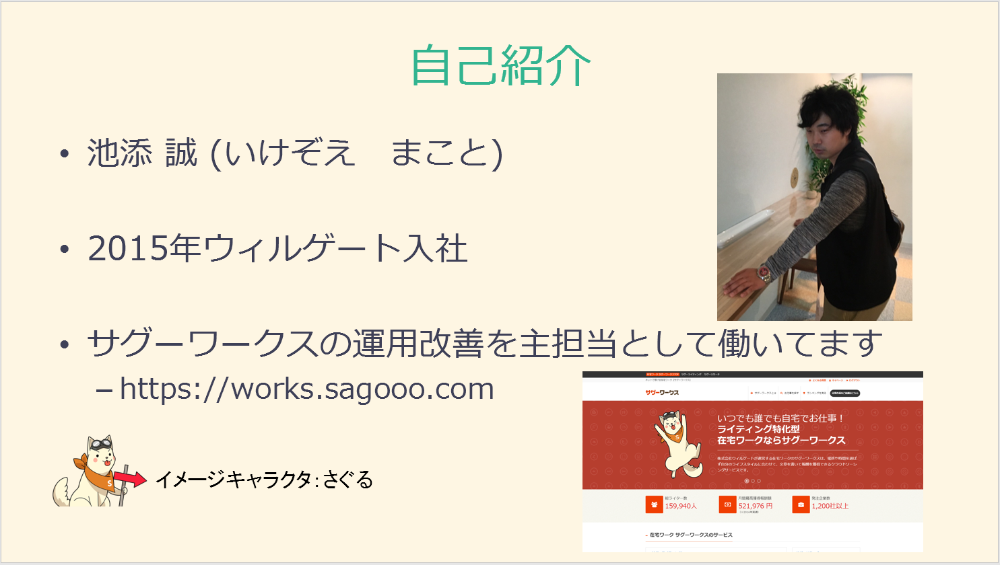
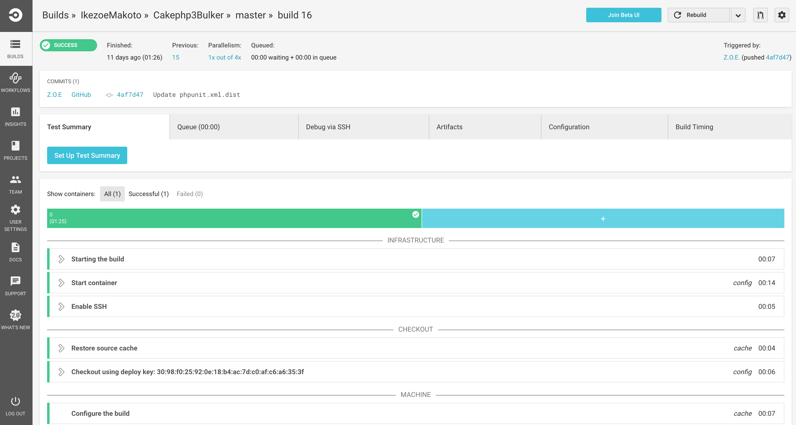

# cakephp3 のプラグイン作った話
---
## 目次
1. [自己紹介](#自己紹介)
1. [作ったもの](#作ったもの)
1. [使い方](#使い方)
1. [作ろうと思った背景](#作ろうと思った背景)
1. [プラグインの作り方](#プラグインの作り方)
1. [大変だったこと](#大変だったこと)
---
## 自己紹介


## 作ったもの

---
## 作ったもの
- https://packagist.org/packages/ikezoe-makoto/cakephp3bulker  

- cakephp3 にバルクインサートを提供するプラグインを作った(更新もできるよ)
---
## テストも書いてます
CicleCIでテスト回してます！

---
## 使い方
```
# インストール  
composer require ikezoe-makoto/cakephp3bulker
  
# プラグイン読み込み
// config/bootstrap.php
Plugin::load('Cakephp3Bulker');
```
※README に一応書いてあります。
---
## 使い方
```
// 使用方法 (src/Model/Table/UsersTable.php)
class UsersTable extends Table
{
    public function example()
    {
        // 使用したいモデルで Behavior を読み込む
        $this->addBehavior('Cakephp3Bulker.Bulker');
        ...
        // $manySaveData にプライマリーキーがあれば更新になる。
        $this->saveBulk($manySaveData);
    }
}
```
---
## 作ろうと思った背景
- cakephp3でバルクインサートしたかった
- 調べてもプラグインはなかった
- プラグインでパパッと導入したかった
- 今ならプラグインないし、作ったらバズるかも？
---
## プラグインの作り方
1. cake3ではbakeでプラグインの初期状態も作ることができます

```
$ bin/cake bake plugin Cakephp3Bulker
$ cd plugins/Cakephp3Bulker
$ tree
├── composer.json
├── config
│   └── routes.php
├── src
│   └── Controller
│       └── AppController.php
├── tests
└── webroot
```

---
2. bakeできたらここに必要な処理を記述していきます
1. ロジックの実装が終わったらcomposer.jsonにパッケージ名など必要な情報を記述しgithubなどにあげます
1. composer require で入れられるようにするために packagist に登録する

ここまですればプラグインとして公開されます！
---
## 大変だったこと
- プラグインのテストを書くということ  
    - cake3のbakeのデフォルトではアプリケーションからのテストをする前提でしか書かれていない
    - プラグインとして提供するためには単体でのテストを書きたい
- (プラグイン関係ないけど)英語でドキュメントを書くということ
---
## 意外と楽だったこと
- CIの連携
- プラグインとして機能を実装すること
- packagistへの登録