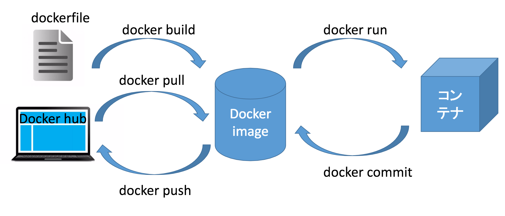

# docker 入門
---
## 目次
1. [dockerとは](#dockerとは)
1. [dockerとコマンド](#dockerとコマンド)
1. [コンテナに対する操作](#コンテナに対する操作)
1. [dockerfile](#dockerfile)
1. [docker-compose](#docker-compose)
---
# dockerとは
## VM と コンテナ
- VM
    - VMはハイパーバイザを通してホストOSに対してのシステムコールを解釈させるなどの必要がある
    - それぞれのVMには全て独立したOS・アプリケーション・ライブラリが必要
- コンテナ
    - ホストのカーネルは実行されるコンテナと共有される（コンテナは常にホストと同じカーネルを使う必要がある）
    - コンテナ内で実行されるプロセスはホストで実行されるプロセスと同等で、ハイパーバイザの実行に伴うオーバーヘッドが存在しない
---
## 利点
- ホストOSとリソースを共有するのでVMに比べて遙かに効率的
- ポータビリティが非常に高いので特定の環境に依存することがない
- 軽量なので1つのマシンで複数のコンテナを実行できる
- 構築に時間などをかけることがなく、ダウンロードするだけで実行することが可能

(ここら辺でデータの永続化の話をしておく)
---
# dockerとコマンド

---
# コンテナに対する操作
---
# コンテナをたてよう(run)
hello world
```
docker run hello-world
```

ubuntu
```
docker run -i -t ubuntu /bin/bash
```

nginx
```
docker run -p 8080:80 nginx
```
---
# run のよく使うオプション
オプションは後半で説明する dockerfile や docker-compose.yml で指定可能
- -d
    - バックグラウンドで実行
- -e
    - 環境変数をセットする
- -i
    - インタラクティブで起動(-tと合わせて使うことがおおい)
- --link
    - 他のコンテナに対するリンクを追加
- --name 
    - コンテナに名前をつけられる
    - 例) dcoker run --name=hoge ubuntu
- -t
    - ttyをコンテナのプロセスに割り当てる
- -v
    - ボリュームをマウントする
    - 例) docker run -v /var/www/html:/web/app ubuntu
- -p
    - expose, 露出用のポートの指定ができる
    - 実際にはローカルポートフォワーディングされる
    - 例) docker run -p 8080:80 ubuntu
- -w
    - 作業ディレクトリの指定
    - 例) docker run -it -v /var/www/html:/web/app -w /web/app ubuntu /bin/bash
---
# コンテナに接続する(attach)
```
docker attach [コンテナ名/コンテナID]
```
※コンテナのメインプロセスが終了するとコンテナは落ちる仕様なので抜けるときは Ctrl+a, Ctrl+d で抜けよう
---
# コンテナにコマンドを実行させる(exec)
```
docker exec [コンテナ名/コンテナID] cat /etc/redhat-release
docker exec -it [コンテナ名/コンテナID] /bin/bash
```
※こっちは普通に抜けて大丈夫
---
# コンテナの一覧(ps)
実行中のコンテナ一覧を確認する
```
docker ps
```
-a オプションで全コンテナ一覧も確認できる
```
docker ps -a
```
---
# コンテナの終了(stop)
特定のコンテナを停止したいとき
```
docker stop [コンテナID/コンテナ名]
```
---
# コンテナの削除(rm)
特定のコンテナを削除したいとき
```
docker rm [コンテナID/コンテナ名]
```
---
# イメージに対する操作
---
# イメージの検索(search)
```
docker search centos
```
---
# イメージの取得(pull)
```
docker pull centos
```
---
# イメージ一覧(images)
docker イメージの一覧を確認できる
```
docker images
```
---
# イメージの削除(rmi)
```
docker rmi [イメージ名/イメージID]
```
---
# dockerfile
docker イメージを記述しておけるもの
```
# dockerfileからイメージを構築する際のコマンド
docker build -t [TAG名] .
```
---
# docker-compose
docker の１サービス１コンテナの思想に従い、複数のサービスを使用する際に使う。
docker-compose.yml という設定ファイルを記述し、これを元に docker コンテナ群を構築することができる