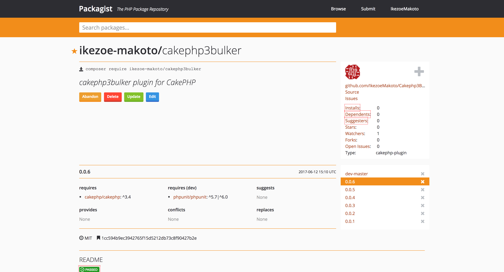

# cakephp3 のプラグイン作った話
## 目次

1. [作ったもの](#作ったもの)
1. [使い方](#使い方)
1. [作ろうと思った背景](#作ろうと思った背景)
1. [プラグインの作り方](#プラグインの作り方)
1. [ハマったこと](#ハマったこと)

## 作ったもの
https://packagist.org/packages/ikezoe-makoto/cakephp3bulker



cakephp3 にバルクインサートを提供するプラグインを作った(更新もできるよ)

## 使い方
README に一応書いてあります。
- インストール  
```
composer require ikezoe-makoto/cakephp3bulker
```
- 読み込み  
bootstrap.php でプラグインを読み込む
```php:/config/bootstrap.php
Plugin::load('Cakephp3Bulker');
```
モデルで Behavior を読み込む
```php:src/Model/Table/UsersTable.php
class UsersTable extends Table
{
    public function example()
    {
        $this->addBehavior('Cakephp3Bulker.Bulker');
        ...
    }
    ...
}
```
- 使用方法  
saveBulk を使って保存、更新できる  
$manySaveData にプライマリーキーがあれば更新になる。
```php:src/Model/Table/UsersTable.php
$this->saveBulk($manySaveData);
```

## 作ろうと思った背景
cakephp3でバルクインサートしたいと思って調べたが、実装するための方法はあっても、
プラグインなどは何もなかった。どうせなら自分で実装しないでプラグインでパパッと導入したいよね。
今ならプラグインないし、作ったらバズるかも？という安直な思考で作りました。

## プラグインの作り方
1. cake3ではbakeでプラグインの初期状態も作ることができます。
```
$ bin/cake bake plugin Cakephp3Bulker
$ cd plugins/Cakephp3Bulker
$ tree
.
├── README.md
├── composer.json
├── config
│   └── routes.php
├── phpunit.xml.dist
├── src
│   └── Controller
│       └── AppController.php
├── tests
│   └── bootstrap.php
└── webroot
    └── empty
5 directories, 7 files
```
2. bakeできたらここに必要な処理を記述していきます。
1. ロジックの実装が終わったらcomposer.jsonにパッケージ名など必要な情報を記述しgithubなどにあげます。
1. compoer require で入れられるようにするために packagist に登録する

ここまですればプラグインとして公開されます！
## 大変だったこと
- プラグインのテストを書くということ  
    - cake3のbakeのデフォルトではアプリケーションからのテストをする前提でしか書かれていない
    - プラグインとして提供するためには単体でのテストを書きたい
- 英語でドキュメントを書くということ
